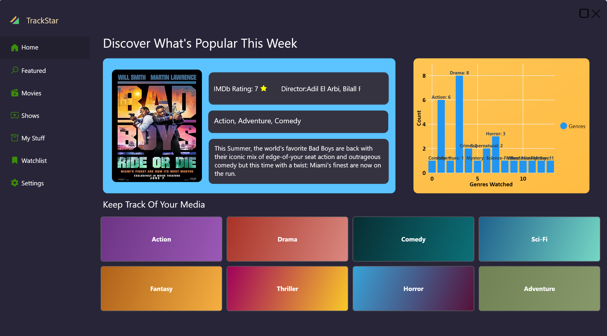

# TrackStar App

## Table of Contents
1. [Introduction](#introduction)
2. [Features](#features)
3. [Technologies Used](#technologies-used)
4. [Usage](#usage)
5. [Screenshots](#screenshots)
6. [Technologies Used](#technologies-used)
7. [Contributing](#contributing)
8. [License](#license)
9. [Contact](#contact)

## Introduction

TrackStar is your ultimate companion for tracking movies and TV series. Whether you're a casual viewer or a dedicated binge-watcher, TrackStar helps you manage your watchlist, track your viewing progress, and discover new content tailored to your tastes.

## Features

- **Comprehensive Watchlist Management**: Easily add, remove, and organize movies and TV shows in your watchlist.
  
- **Progress Tracking**: Keep track of which episodes you've watched and where you left off in each series.
- **Smart Recommendations**: Get personalized recommendations based on your viewing history and preferences.
- **Detailed Information**: Access comprehensive details about movies and TV shows, including cast, crew, ratings, and reviews.
- **Search Functionality**: Quickly find movies and TV shows with our powerful search feature.
- **User-friendly Interface**: Enjoy a sleek, intuitive design that makes navigation a breeze.
- **Cross-platform Sync**: Keep your watchlist and progress synced across all your devices.

  Usage

Adding Content:

Use the search bar to find movies or TV shows.
Click the '+' button to add items to your watchlist.

Tracking Progress:

Navigate to your watchlist.
For TV shows, mark episodes as watched.
For movies, mark them as watched once completed.

Discovering New Content:

Check the 'Recommended' tab for personalized suggestions.
Explore 'Popular' and 'Trending' sections for crowd favorites.

