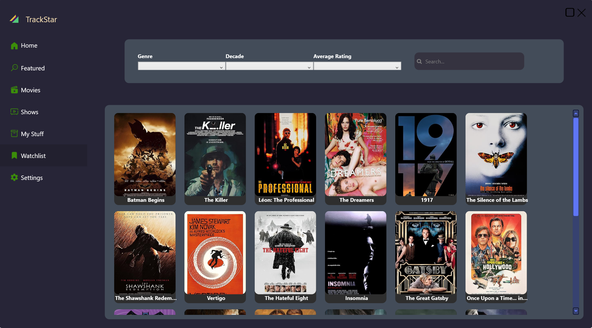
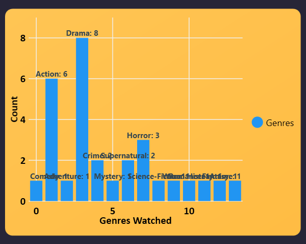
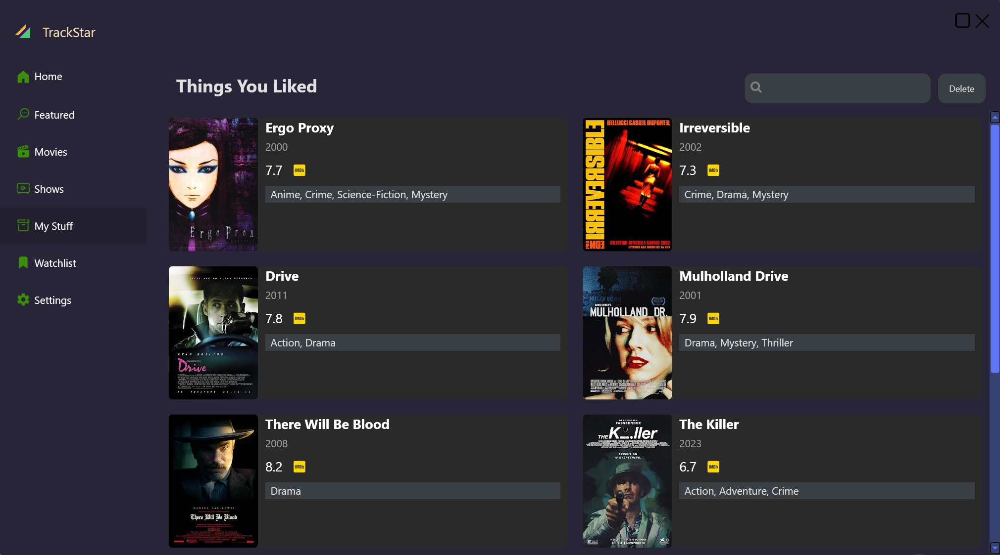
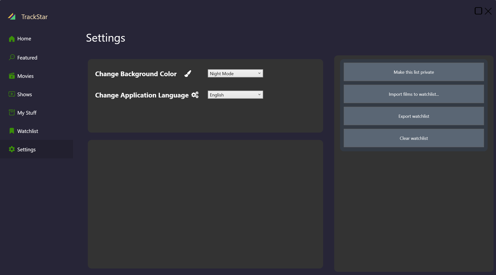
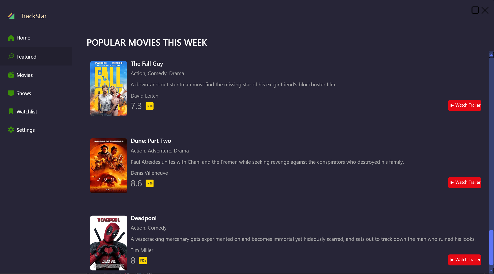
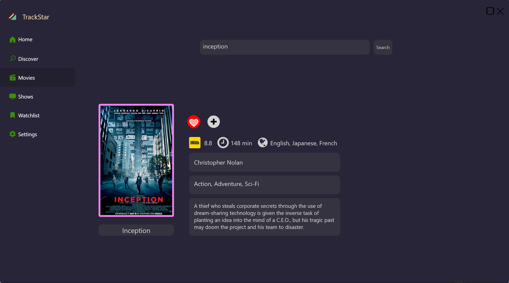

# TrackStar App

## Table of Contents
1. [Introduction](#introduction)
2. [Features](#features)
3. [Technologies Used](#technologies-used)
4. [Usage](#usage)
6. [Contributing](#contributing)
6. [License](#license)
7. [Contact](#contact)

## Introduction

TrackStar is your ultimate companion for tracking movies and TV series. Whether you're a casual viewer or a dedicated binge-watcher, TrackStar helps you manage your watchlist, track your viewing progress, and discover new content tailored to your tastes.

## Features

1. **Comprehensive Watchlist Management**: Easily add, remove, and organize movies and TV shows in your watchlist.

   

2. **Progress and Statistics**: Keep track of which genres you've watched and view your viewing statistics.

   

3. **Marking Favorite Shows and Movies**: Highlight your favorite content and access all the details about them.

   

4. **Detailed Information**: Access comprehensive details about movies and TV shows, including cast, crew, ratings, episodes, and reviews.

   

5. **Search Functionality**: Quickly find movies and TV shows with our powerful search feature.

6. **User-friendly Interface**: Enjoy a sleek, intuitive design that makes navigation a breeze.

   

7. **Access to Latest Movies/Series Metadata**: Get access to the latest TV series and movies, including sneak peeks and trailer links.

   
8. **Access to Latest Movies**: Get access to the latest movies, metadata and informations.

   
      
   

9. **Language Support and Dark Mode**: Use Dark Mode and enjoy additional language support for a customized experience.

## Technologies Used

- .NET C#
- Visual Studio
- WPF (Windows Presentation Foundation)
- Live Charts
- Font Awesome

APIs Used:
- TMDB API
- TV Maze API
- OMDB API

## Usage

1. **Adding Content**: 
   - Use the search bar to find movies or TV shows. 
   - Click the '+' button to add items to your watchlist.
   - Click the hart button if the show/movie is your favorite.

2. **Tracking Progress**: 
   - As you add up movies/series app will automatically track the genres you watch. 
   - For TV shows, mark the show for watchlist/favorite.
   - For movies, mark them afor watchlist/favorite.

3. **Discovering New Content**: 
   - Check the 'Recommended' tab for personalized suggestions. 
   - Explore 'Popular' and 'Trending' sections for crowd favorites.

## Contributing

We welcome contributions to TrackStar! If you'd like to contribute, please follow these steps:

1. Fork the repository
2. Create a new branch for your feature
3. Commit your changes
4. Push to the branch
5. Create a new Pull Request

## License

This project is licensed under the [MIT License](LICENSE.md).

## Contact

For inquiries or support, you can reach out to us at [javadsoltanov@gmail.com](mailto:javadsoltanov@gmail.com).

