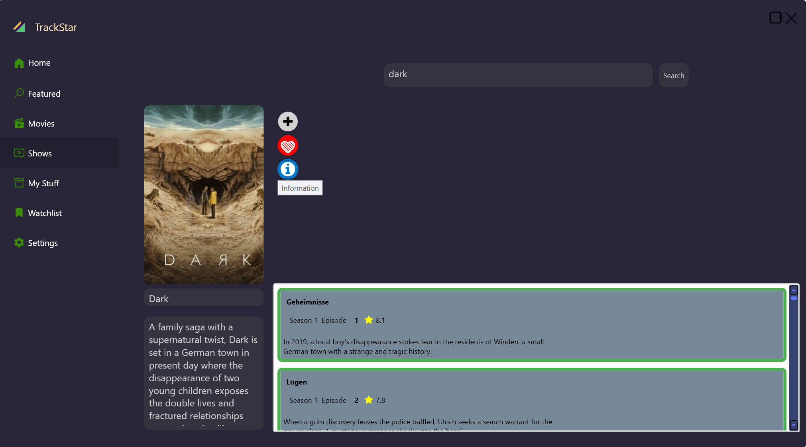

Certainly, I'd be happy to help you adjust and expand the README file. I'll correct the spelling errors, organize the content, and place the pictures below each feature accordingly. Here's the revised and expanded version:

# TrackStar App

## Table of Contents
1. [Introduction](#introduction)
2. [Features](#features)
3. [Technologies Used](#technologies-used)
4. [Usage](#usage)
5. [Screenshots](#screenshots)
6. [Contributing](#contributing)
7. [License](#license)
8. [Contact](#contact)

## Introduction

TrackStar is your ultimate companion for tracking movies and TV series. Whether you're a casual viewer or a dedicated binge-watcher, TrackStar helps you manage your watchlist, track your viewing progress, and discover new content tailored to your tastes.

## Features

1. **Comprehensive Watchlist Management**: Easily add, remove, and organize movies and TV shows in your watchlist.

   

2. **Progress and Statistics**: Keep track of which genres you've watched and view your viewing statistics.

   

3. **Marking Favorite Shows and Movies**: Highlight your favorite content and access all the details about them.

   

4. **Detailed Information**: Access comprehensive details about movies and TV shows, including cast, crew, ratings, episodes, and reviews.

   

5. **Search Functionality**: Quickly find movies and TV shows with our powerful search feature.

6. **User-friendly Interface**: Enjoy a sleek, intuitive design that makes navigation a breeze.

   

7. **Access to Latest Movies/Series Metadata**: Get access to the latest TV series and movies, including sneak peeks and trailer links.

   

8. **Language Support and Dark Mode**: Use Dark Mode and enjoy additional language support for a customized experience.

## Technologies Used

- .NET C#
- Visual Studio
- WPF (Windows Presentation Foundation)
- Live Charts
- Font Awesome

APIs Used:
- TMDB API
- TV Maze API
- OMDB API

## Usage

1. **Adding Content**: 
   - Use the search bar to find movies or TV shows. 
   - Click the '+' button to add items to your watchlist.

2. **Tracking Progress**: 
   - Navigate to your watchlist. 
   - For TV shows, mark episodes as watched. 
   - For movies, mark them as watched once completed.

3. **Discovering New Content**: 
   - Check the 'Recommended' tab for personalized suggestions. 
   - Explore 'Popular' and 'Trending' sections for crowd favorites.

## Screenshots

(You can add more screenshots here if needed)

## Contributing

We welcome contributions to TrackStar! If you'd like to contribute, please follow these steps:

1. Fork the repository
2. Create a new branch for your feature
3. Commit your changes
4. Push to the branch
5. Create a new Pull Request

## License

This project is licensed under the [MIT License](LICENSE.md).

## Contact

For any questions or support, please contact us at [support@trackstar.com](mailto:support@trackstar.com).

Would you like me to explain or break down any part of this README file?
